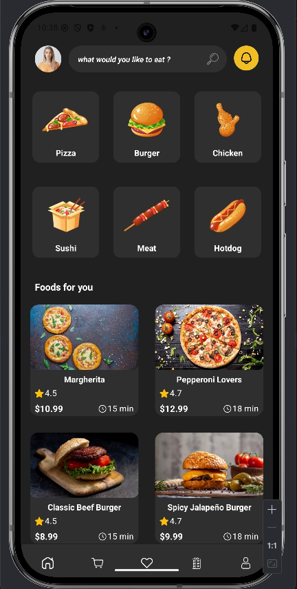
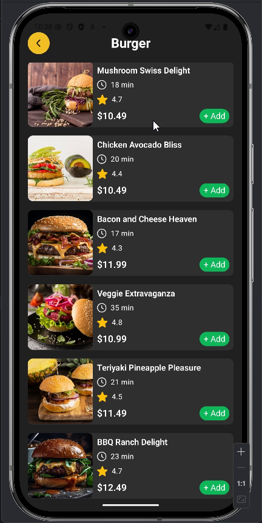
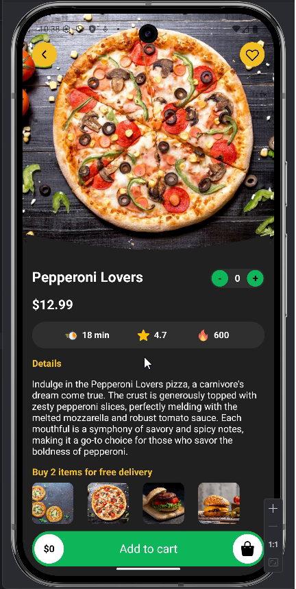
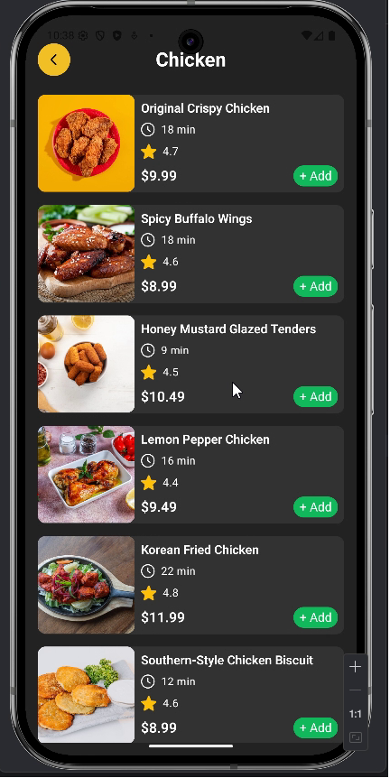

# 🍔 FoodApp

A modern Android food ordering application built with **Kotlin** and **Jetpack Compose** following the **MVVM architecture**.

## 📱 Screenshots

<p align="center">
  
  
</p>

<p align="center">
  
  
</p>

## ✨ Features

- Browse food categories
- View recommended meals
- Food details screen
- Add items to cart
- Update cart quantity
- Modern Jetpack Compose UI
- Firebase integration

## 🛠 Tech Stack

- Kotlin
- Jetpack Compose
- MVVM
- Firebase Realtime Database
- Material Design 3
- Navigation Compose

## 🚀 Getting Started

```bash
git clone https://github.com/AhmedSameh70/FoodApp.git
```

Open the project in Android Studio and sync Gradle.

## 👨‍💻 Author

Ahmed Sameh